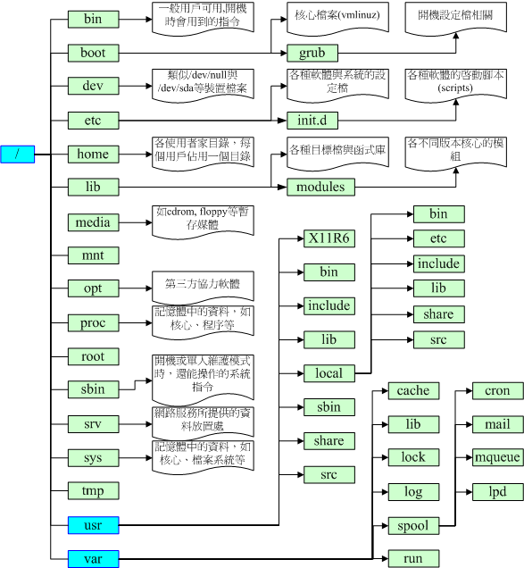

# Linux文件权权限与目录配置

## 1.使用者与群组

在我们Linux系统当中，默认的情况下，所有的系统上的账号与一般身份使用者，还有那个root的相关信息， 都是记录在/etc/passwd这个文件内的。至于个人的密码则是记录在/etc/shadow这个文件下。 此外，Linux所有的组名都纪录在/etc/group内！这三个文件可以说是Linux系统里面账号、密码、群组信息的集中地.

## 2. Linux文件权限概念

目录的x代表的是用户能否进入该目录成为工作目录

chgrp ：改变文件所属群组
chown ：改变文件拥有者
chmod ：改变文件的权限, SUID, SGID, SBIT等等的特性

```shell
[root@www ~]# chgrp [-R] dirname/filename ...

[root@www ~]# chown [-R] 账号名称 文件或目录
[root@www ~]# chown [-R] 账号名称:组名 文件或目录

[root@www ~]# chmod [-R] xyz 文件或目录
[root@www ~]# chmod 777 .bashrc
[root@www ~]# chmod  u=rwx,go=rx  .bashrc
[root@www ~]# chmod  a+w  .bashrc
[root@www ~]# chmod  a-x  .bashrc
```

## 3. Linux目录配置
很多读者都会误会/usr为user的缩写，其实usr是Unix Software Resource的缩写，
